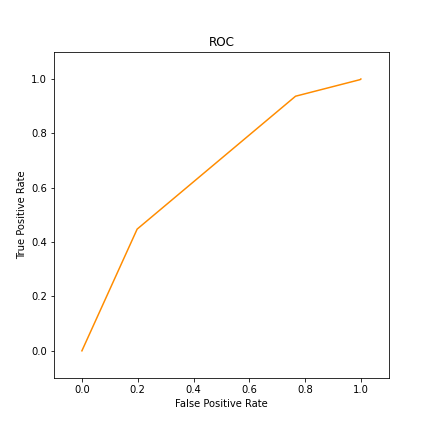

# 分类技术——二分网络上的链路预测

## 1. 实验内容

1. 采用二分网络模型，对“用户-电影”打分数据进行建模
2. 给出节点相似性度量指标
3. 基于相似性在二分网络上进行链路预测
4. 采用交叉验证预测结果
5. 画出ROC曲线来度量预测方法的准确性

## 2. 分析及设计

该网络包含两类节点——用户节点和电影节点，假设电影数为$$n$$，用户数为$$m$$可以建立$$m\times n$$评分矩阵$$R$$，其中的元素$$r_{i,j}$$表示第$$i$$个用户对第$$j$$个电影的打分情况，缺省值用$$3$$填充。

我们需要设定一个阈值$$t$$作为分类的依据——评分大于$$t$$表示给用户推荐该电影，评分大于$$t$$表示不给用户推荐该电影。我们问题是，预测用户对电影的评分，或是否向某个用户推荐某个电影。

由于用户数大于电影数，且一般情况下用户数比电影数增长更快，所以考虑**基于物品的协同过滤算法**（ItemCF）。

基于物品的协同过滤算法主要分为两步：

1. 计算物品之间的相似度
2. 根据物品的相似度和用户的历史行决定是否推荐该物品

假设物品$$i$$和物品$$j$$之间的相似度定义为
$$
w_{i j}=\frac{|N(i) \cap N(j)|}{\sqrt{|N(i)||N(j)|}}
$$
其中$$|N(i)|$$表示喜欢物品$$i$$的用户数，$$|N(j)|$$表示喜欢物品$$j$$的用户数，$$|N(i) \cap N(j)|$$表示同时喜欢物品$$i$$和物品$$j$$的用户数。可以得到一个$$n\times n$$的矩阵$$W$$

计算（预测）用户$$u$$对电影$$j$$的评分$$p_{u j}$$由用户$$u$$对电影$$i$$的评分以及电影$$i$$和电影$$i$$的相似度决定
$$
p_{u j}=\sum_{i \in N(u) } w_{j i} r_{u i}
$$
其中$$N(u)$$表示用户$$u$$打过分的电影。

最后，在根据阈值决定是否推荐，这样就完成了分类。

## 3. 详细实现

首先读取`ratings.dat`中的数据

```python
with open(file_path) as f:
    data = f.read().strip().split()
random.shuffle(data)
```

由于要求做交叉验证，并且要绘制ROC曲线，所以算法主体外包含两层循环

```python
for rating_threshold in np.arange(0, 5 + threshold_step, threshold_step):
    # threshold_step 表示阈值步长
    for episode in range(k):
        # k 表示k-折交叉验证
        # ...
        # 算法主体
```

对于算法主体，首先划分训练集和验证集

```python
val_data = data[episode * n_step: (episode+1) * n_step]
train_data = data[:episode * n_step] + data[(episode+1) * n_step:]
```

建立评分矩阵$$R$$，缺省值用$$3$$填充

```python
# 评分矩阵R，n_user × n_item
# r_ndarray用于计算相似度矩阵
# r_v_ndarray用于记录用户真实的历史行为，预测时将会用到
r_ndarray = 3 * np.ones((n_user, n_item))
r_v_ndarray = np.zeros((n_user, n_item))
for line in train_data:
    s = line.strip().split('::')
    r_ndarray[int(s[0])-1][int(s[1])-1] = int(s[2])
    r_v_ndarray[int(s[0]) - 1][int(s[1]) - 1] = int(s[2])
```

计算$$|N(i)|$$，即喜欢物品$$i$$的用户数

```python
exist = (r_ndarray > rating_threshold) * 1.0
n_item2user = [np.sum(exist[:, _]) for _ in range(n_item)]
```

计算每两个物品之间的相似度

```python
s_item_ndarray = np.ones((n_item, n_item))
for i in range(n_item):
    for j in range(i + 1, n_item):
        n_i = n_item2user[i]
        n_j = n_item2user[j]
        n_ij = np.sum(np.dot(exist[:, i], exist[:, j]))
        sq = np.sqrt(n_i*n_j)
        if sq:
            s_item_ndarray[i][j] = n_ij / sq
        else:
            s_item_ndarray[i][j] = 0
        if np.isnan(s_item_ndarray[i][j]):
            s_item_ndarray[i][j] = 0
        s_item_ndarray[j][i] = s_item_ndarray[i][j]
```

验证预测结果，并计算TPR和FPR

```python
for line in val_data:
    s = line.strip().split('::')
    user, item, rating = int(s[0]) - 1, int(s[1]) - 1, int(s[2])
    # 以3为标准，推荐为true，不推荐为false
    real = rating > 3
    # 注意这里使用r_v_ndarray
    temp = (r_v_ndarray[user, :] > 0) * 1.0
    t = np.multiply(temp, s_item_ndarray[:, item])
    # 预测评分=相似度×历史评分
    if np.sum(t) < 1e-5:
        # 如果t是全零向量，意味着没有可以参考的相似度，于是用3填充
        p = 3
    else:
        p = np.dot(t / np.sum(t), r_ndarray[user, :])
    # 推荐为true，不推荐为false
	prediction = p > rating_threshold
    # 统计TP,TN,FP,FN
    # ...
# 计算TPR和FPR
```

最后根据若干FPR-TPR二元组画出ROC曲线。

## 4. 实验结果

使用4折交叉验证，阈值设定为$$0,1,2,3,4,5$$，得到如下ROC曲线



| 阈值 |   FPR    | TPR      |
| :--: | :------: | :-----: |
|  0   |   1.0    | 1.0      |
|  1   | 0.995524 | 0.999323 |
|  2   | 0.996643 | 0.997631 |
|  3   | 0.765719 | 0.936728 |
|  4   | 0.198031 | 0.447809 |
|  5   |   0.0    | 0.0      |

由ROC曲线可以发现，实现效果并不理想，可能的原因包括

- 数据过于稀疏，缺省值的填充方式一定程度上影响了相似度矩阵的计算
- 交叉验证分组不够，训练集不足以代表原始分布
- 阈值设定精度不足

其他问题

- 计算复杂度过高，计算相似度矩阵，至少需要$$O(n^2)$$的计算复杂度，每个episode花费时间主要用于计算相似度矩阵。

**\* 运行方式**

使用全部数据，4折交叉验证，阈值步长为1

```
python hw1.py -k 4 -t 1
```

使用部分数据，4折交叉验证，阈值步长为1

```
python hw1.py -k 4 -t 1 --min
```

## 5. 心得体会

- 数据量过大，运行一次实验可能需要几个小时时间，可以先用小批量数据做实验，将算法调试成功后再使用全部数据运行。
- 协同过滤方法基于相似性预测评分，包括基于物品的协同过滤算法，基于用户的协同过滤算法，混合协同过滤算法，如果时间充足，可以实现一遍，比较不同算法的性能。
- 推荐系统的长尾现象，导致评分数据过于稀疏，使用协同过滤方法并不能很好地解决这一问题。

