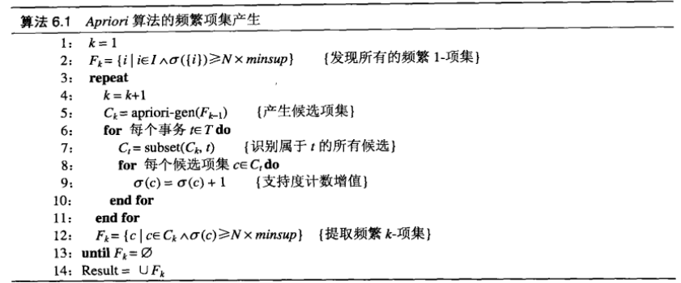
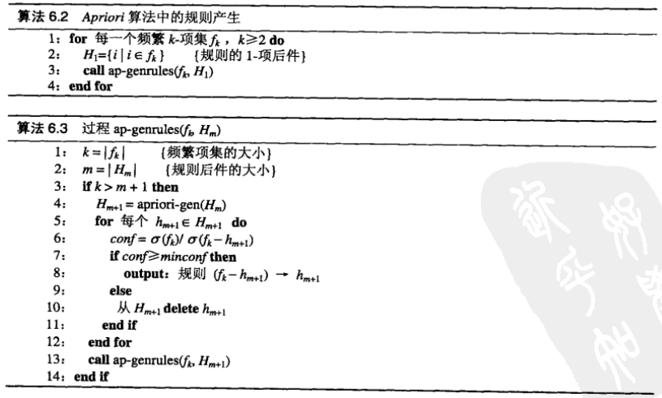

# 关联规则挖掘 美国国会投票记录

## 1. 实验内容

使用*Apriori*算法，支持度设为 30%，置信度为 90%，挖掘高置信度的规则。

## 2. 分析及设计

原始数据包含435项记录，每个记录具有17个属性，分别为

| Index | Attribute Information                  | Value                |
| ----- | -------------------------------------- | -------------------- |
| 1     | Class Name                             | democrat, republican |
| 2     | handicapped-infants                    | y, n                 |
| 3     | water-project-cost-sharing             | y, n                 |
| 4     | adoption-of-the-budget-resolution      | y, n                 |
| 5     | physician-fee-freeze                   | y, n                 |
| 6     | el-salvador-aid                        | y, n                 |
| 7     | religious-groups-in-schools            | y, n                 |
| 8     | anti-satellite-test-ban                | y, n                 |
| 9     | aid-to-nicaraguan-contras              | y, n                 |
| 10    | mx-missile                             | y, n                 |
| 11    | immigration                            | y, n                 |
| 12    | synfuels-corporation-cutback           | y, n                 |
| 13    | education-spending                     | y, n                 |
| 14    | superfund-right-to-sue                 | y, n                 |
| 15    | crime                                  | y, n                 |
| 16    | duty-free-exports                      | y, n                 |
| 17    | export-administration-act-south-africa | y, n                 |

*Apriori*算法主要分为两步：

1. 生成频繁项集
2. 生成规则

### 生成频繁项集

令$$C_k$$为候选$k$-项集的集合，而$$F_k$$为频繁$k$-项集的集合：

- 初始化频繁$1$-项集的集合$$F_1$$
- 根据上一次迭代发现的频繁$(k-1)$-项集，产生新的候选$k$-项集
- 根据候选k项集产生频繁$k$-项集
- 重复2、3步指导频繁$k$-项集为空，或k的值和属性个数相等

*Apriori*算法生成频繁项集的伪代码如下：



### 生成规则

*Apriori*算法采用逐层的方法产生关联规则，并通过频繁项集产生时计算的支持度计算每个规则的置信度。

算法的伪代码如下：



## 3. 详细实现

首先，读取数据

```python
data_path = "./data/house-votes-84.data"
data_df =  pd.read_table(data_path, header=None, sep=',')
```

原始数据的尺寸是$$435\times 17$$

```python
# process raw data
data_ar = np.array(data_df)
n_att_raw = data_ar.shape[1]

n_item = data_ar.shape[0]
n_att = n_att_raw * 2

data = np.zeros((n_item, n_att))
for i in range(n_item):
    if data_ar[i][0] == 'democrat':
        data[i][0] = 1
    else:
        data[i][n_att_raw] = 1
    for j in range(1, n_att_raw):
        if data_ar[i][j] == 'y':
            data[i][j] = 1
        elif data_ar[i][j] == 'n':
            data[i][j + n_att_raw] = 1
```

处理后的数据保存为`ndarray`类型，其尺寸为$$435\times 34$$，对于某一行（某个记录）：

- 第1列：Class Name=**democrat**
- 第2-17列：相应属性取值为 **y**
- 第18列：Class Name=**republican**
- 第19-34列：与第2-17列类似，相应属性取值为 **n**

列索引对应的属性名为

```python
attribute_information = [
    'Class Name: democrat',
    'handicapped-infants: yes',
    'water-project-cost-sharing: yes',
    
    ...
    
    'duty-free-exports: yes',
    'export-administration-act-south-africa: yes',
    'Class Name: republican',
    'handicapped-infants: no',
    'water-project-cost-sharing: no',
    
    ...
    
    'duty-free-exports: no',
    'export-administration-act-south-africa: no'
]
```

`l_att_comb`用于存储候选$k$-项集，其初始化为候选$1$-项集

```python
# init l_att_comb
l_att_comb = []
for i in range(n_att):
    l_att_comb.append({i})
# l_att_comb is a list containing all 1-item candidate itemset
```

`F`用于存储频繁项集及相应的支持度，`F[i]`表示长度为$$i+1$$的频繁项集的集合，其初始化为

```python
# F[i] contain frequent itemset and support 
#      with the length of itemset is i+1
F = [] 
```

函数`find_k_fi`根据候选项集产生频繁项集，以为为生成一下个候选项集的中间变量

```python
def find_k_fi(l, support):
    # generate frequent itemset according to the candidate itemset
    # e.g. l=[{1,2,3},{2,3,5},{4,6,9},...]
    if not l:
        return []
    global data
    n = len(data)
    d = {}
    k = len(l[0]) 
    
    # gerate keys for d
    for itemset in l:
        d[tuple(sorted(itemset))] = 0
        d[tuple(sorted(itemset))] = 0
    
    # compute support for each itemset
    for key in d.keys():
        for line in data:
            s = 0
            for a in key:
                if line[a]:
                    s += 1
            if s == k:
                d[key] += 1
    l_l = []
    for key in list(d.keys()):
        if d[key] / n < 0.3:
            del d[key]
        else:
            if set(key) not in l_l:
                l_l.append(set(key))
                
    return d, l_l
```

函数`gen_next_fi`根据函数`find_k_fi`生成的中间变量，产生下一个候选项集

```python
def gen_next_ci(l):
    # generate candidate itemset according to last frequent itemset
    # l is a list containing all k-item frequent itemset
    # e.g. l=[{1,2,3},{2,3,5},{4,6,9},...]
    if not l:
        return []
    new_l = []
    k = len(l[0])
    len_l = len(l)
    for i in range(len_l):
        for j in range(i + 1, len_l):
            itemset1 = l[i]
            itemset2 = l[j]
            set1_test = sorted(itemset1)
            set2_test = sorted(itemset2)
            if set1_test[: k-1] == set2_test[: k-1]:
                new_l.append(itemset1 | itemset2)
    return new_l
```

至多执行34轮，生成全部频繁项集，保存在`F`中

```python
for k in range(n_att):
    print('k:', k)
    print('length of l_k):', len(l_att_comb))
    c_k, l_next = find_k_fi(l_att_comb, support=0.3)
    F.append(c_k)
    l_att_comb = gen_next_ci(l_next)
    if not len(l_att_comb):
        break
print("k_max =", k)
print("done")
```

`rules`用于存放全部规则，`rules[i]`表示频繁i-项集能够生成的全部规则的集合，其初始化为

```python
rules = [[],]
# rules[i] contain (rule, support) with the length of itemset is i
```

函数`gen_rules`根据频繁i-项集及规定的置信度阈值，生成相应的全部规则

```python
def gen_rules(k_, confidence):
    global F, data
    r = []
    f = F[k_-1]
    for itemset, sup in f.items():
        # e.g. itemset==(0, 3, 8, 16)
        #      sup==138
        sup1 = sup
        subset = get_subset(itemset)
        for ss in subset:
            # ss is a sub set of itemset
            # conf : sup(itemset) / sup(ss)
            # rule : ss -> itemset - ss
            if len(ss) > 1:
                sup2 = F[len(ss)-1][tuple(sorted(ss))]
                conf = sup1 / sup2
                if conf >= confidence:
                    r.append((set(ss), set(itemset)-set(ss), conf))
    return r
```

其中，需要实现求子集的函数`get_subset`

```python
def get_subset(s):
    # return all subsets of set s
    # s is iterable and return is a list 
    n = len(s)
    result = []
    for i in range(2 ** n): 
        combo = []
        for j in range(n):
            if(i >> j) % 2:
                combo.append(s[j])
        result.append(combo)
    result.remove([])
    result.remove(list(s))
    
    return result
```

对于所有的频繁k-项集，生成其对应的全部规则，存放在`rules`中

```python
for i in range(1, k+1):
    rules.append(gen_rules(i, confidence=0.9))
```

最后将结果保存在`./result.txt`中

```python
def save_result(result, path):
    global attribute_information
    with open(path, 'w') as f:
        for rs_k in result:
            if rs_k:
                for a, b, conf in rs_k:
                    # e.g. a, b, conf =({7, 9}, {0}, 0.971)
                    a = set([attribute_information[i] for i in a])
                    b = set([attribute_information[i] for i in b])
                    conf = "confidence: {}".format(conf)
                    f.write(str((a, b, conf)) + '\n')

save_path = './result.txt'
save_result(rules, save_path)
```

## 4. 实验结果

实验结果保存在`./result.txt`中，共计2939条规则。

以`./result.txt`中第1行为例：

```
({'Class Name: democrat', 'handicapped-infants: yes'}, {'adoption-of-the-budget-resolution: yes'}, 'confidence: 0.9102564102564102')
```

其表示的规则为
$$
\{'Class Name=democrat', 'handicapped-infants=yes'\}\\ \rightarrow \{'adoption-of-the-budget-resolution=yes'\}
$$
其置信度为0.9102564102564102

## 5. 心得体会

1. 统计（原始）记录中的项时，若值为 *y* 或 *n*，则需要统计该项，若值为 ?，则不统计该项；在处理过数据后，大部分行含有17个非0项，并且前17项和后17项取值相反。
2. 原始数据经处理后得到的矩阵十分稀疏，对于更加庞大的数据，内存占用十分严重，在压缩存储上有待改进。
3. 每个项集中的元素尽量按字典序排列，可以在`gen_next_ci`函数中可以通过一些技巧降低计算复杂度，并且在生成全部频繁项集`F`后便于检查和梳理。
