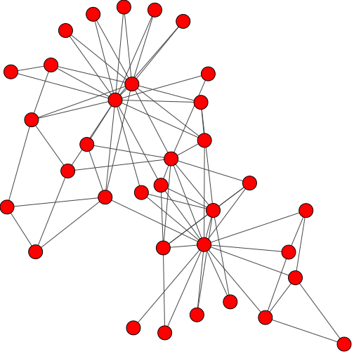
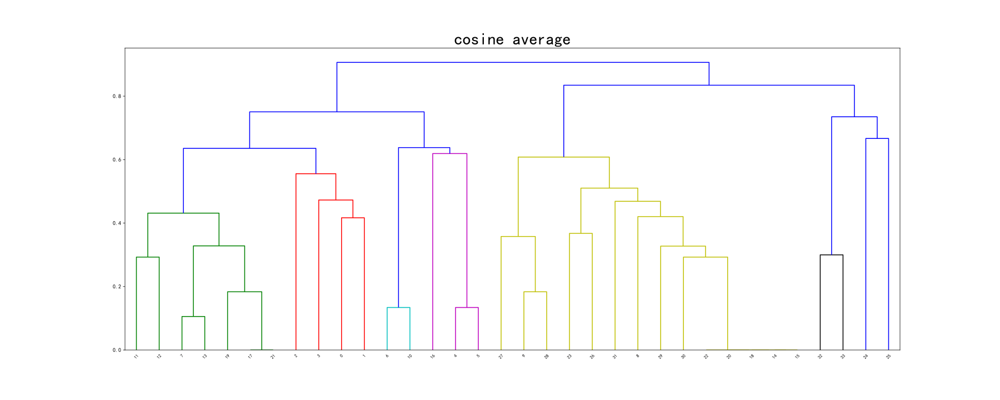
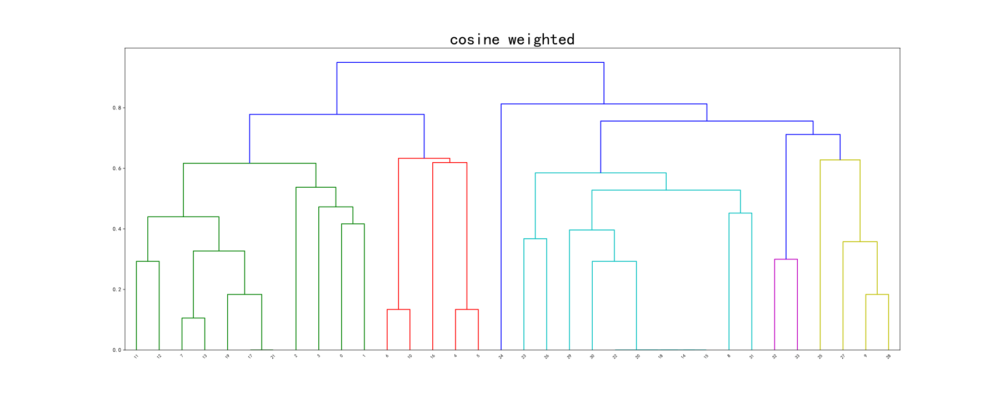
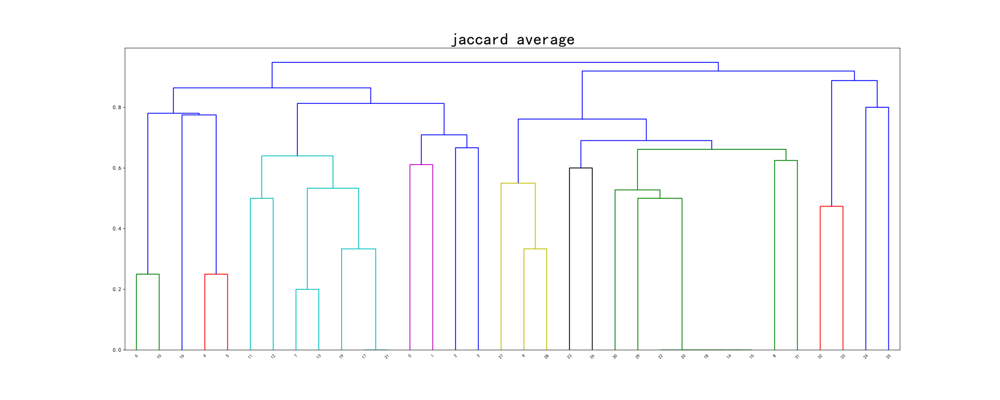
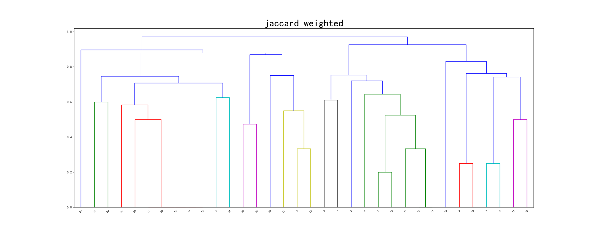
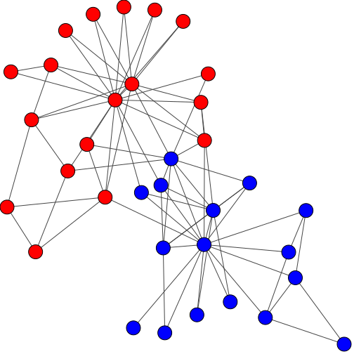

# 聚类技术  复杂网络社团检测

## 1. 实验内容

1. 导入 karate.gml 中的空手道网络数据；
2. 根据网络结构特征给出节点相似性度量指标；
3. 采用层次聚类过程对网络数据进行聚类；
4. 计算模块性指标 Q 值，当 Q 值最大时输出聚类结果；
5. 采用 Cytoscape 工具，可视化聚类结果。

## 2. 分析及设计

原始数据包含34个节点，78条边，整个网络是一个无向无权图。



首先将图转化为邻接矩阵$$A$$，$$A$$的第$$i$$行即为节点$$i$$的特征向量（$$34$$维仅包含$$0$$或$$1$$的向量）

另外需要定义两种距离（相似度）——节点之间的距离、簇之间的距离

#### 节点之间的距离

考虑4种**节点**之间的距离

| 名称        | 公式                                                         | 说明                |
| ----------- | ------------------------------------------------------------ | ------------------- |
| 欧氏距离    | $$d_{s,\;t}^2 = \left( {{x_s} - {x_t}} \right) \cdot \left( {{x_s} - {x_t}} \right)'$$ | 两点之间的2范数距离 |
| 余弦距离    | $$d_{s,\;t}^{} = 1 - \frac{{{x_s}{x_t}'}}{{{{\left\| {{x_s}} \right\|}_2} \cdot {{\left\| {{x_t}} \right\|}_2}}}$$ | 1减特征向量夹角余弦 |
| Jaccard距离 | $$d_J=1-\frac{M_{11}}{M_{01}+M_{10}+M_{11}}$$                | 不关心0-0匹配       |
| 海明距离    | $$d_H=1-\frac{M_{11}+M_{00}}{M_{00}+M_{01}+M_{10}+M_{11}}$$  | 关心0-0匹配         |

#### 簇之间的距离

考虑4种**簇**之间的距离

| 名称      | 公式                                                         | 说明                              |
| --------- | ------------------------------------------------------------ | --------------------------------- |
| 单链或MIN | $$d(u, v)=\min (\operatorname{dist}(u[i], v[j]))$$           | 簇间点与点之间的最小距离          |
| 全链或MAX | $$d(u, v)=\max (\operatorname{dist}(u[i], v[j]))$$           | 簇间点与点之间的最大距离          |
| 组平均    | $$d(u, v)=\sum_{i j} \frac{d(u[i], v[j])}{(|u| *|v|)}$$      | 簇间点与点之间的平均距离          |
| 加权      | $$d(u, v)=(\operatorname{dist}(s, v)+\operatorname{dist}(t, v)) / 2$$ | 与组成$$u$$的子簇之间的距离加权和 |

重复执行：

1. 根据簇之间的距离合并最近的两个簇

2. 更新邻接矩阵，以反映新的簇与原来的簇之间的近邻性

3. 计算Q值并记录   $$Q=\frac{1}{2 m} \sum_{v w}\left[A_{v w}-\frac{k_{v} k_{w}}{2 m}\right] \delta\left(c_{v}, c_{w}\right)$$ 

   > A. Clauset, M. E. J. Newman, & C. Moore, Finding community structure in very large networks, Phys. Rev. E 70, 066111 (2004). 

直到仅剩一个簇

## 3. 详细实现

### 读取数据

```python
def read_gml(path):
    # 读取gml文件并返回邻接矩阵
    g = Graph.Read_GML(path)
    adj = g.get_adjacency()
    n = adj.shape[0]
    a = np.array([adj[i] for i in range(n)])
    return a
```

### 执行聚类

根据选定的节点之间的距离与簇之间的距离，执行聚类算法，并保存树形图

```python
def cluster(a, method, metric):
    z = linkage(a, method=method, metric=distance(metric))
    fig = plt.figure(figsize=(25, 10))
    dn = dendrogram(z)
    plt.title('{} {}'.format(metric, method))
    plt.savefig('clusterTree_{}_{}.svg'.format(metric, method))
    return z
```

### 计算Q值

根据公式
$$
Q=\frac{1}{2 m} \sum_{v w}\left[A_{v w}-\frac{k_{v} k_{w}}{2 m}\right] \delta\left(c_{v}, c_{w}\right)
$$
计算出每次合并后的模块度$$Q$$

```python
def computeQ(a, z): 
    n = a.shape[0]
    m = int(np.sum(a) / 2)
    k = [np.sum(a[i]) for i in range(n)]
    c = np.arange(n_v)
    
    def connect(a, b, it):
        # 合并后的更新，时间复杂度O(n),空间复杂度的O(n)
        buffer[it + n] = buffer[a].union(buffer[b])
        del buffer[a]
        del buffer[b] 
        temp = list(buffer[it + n].copy())
        tar = np.min(temp)
        for i in range(len(temp)):
            c[temp[i]] = tar

    buffer = {k: {k} for k in range(n)}
    q = list(range(n_v))   # 合并i次的Q值

    for it, line in enumerate(z):
        connect(int(line[0]), int(line[1]), it)
        q[it + 1] = np.sum([[(a[v][w] - k[v]*k[w]/(2*m)) * (c[v]==c[w])
                         for v in range(n) ]for w in range(n)]) / (2*m) 
    return q
```

### 总体框架

最终得到聚类结果，并绘制模块度$$Q$$随合并次数变化的曲线图

```python
def main(path, method, metric):
    A = read_gml(path)
    Z = cluster(A, method, metric)
    Q = computeQ(A, Z)
    X = list(range(1, A.shape[0] + 1))
    
    plt.figure()
    plt.plot(X, Q)
    plt.title('{} {}'.format(metric, method))
    plt.xlabel('合并次数')
    plt.ylabel('modularity Q')
    plt.savefig('Q_{}_{}_{: 0.5f}_{: 0.5f}.svg'.format(metric, method, max(Q), Q[-2]))
```

### 不同算法的效果

现有4种节点之间的距离和4种簇之间的距离，共16种算法，比较不同算法的效果

```python
file_path = 'karate.gml'

for metric in ['euclidean', 'cosine', 'jaccard', 'hamming']:
    for method in ["single", "complete", "average", "weighted"]:
        main('karate.gml', method=method, metric=metric)
```

## 4. 实验结果

比较不同算法能够得到的最大的$$Q$$值

|                 | 单链或MIN | 全链或MAX   | 组平均      | 加权        |
| --------------- | --------- | ----------- | ----------- | ----------- |
| **欧氏距离**    | 0         | 0           | 0           | 0           |
| **余弦距离**    | 0         | **0.13667** | **0.37147** | **0.37960** |
| **Jaccard距离** | 0         | **0.13667** | **0.37147** | **0.37147** |
| **海明距离**    | 0         | 0           | 0           | 0           |

比较不同算法在聚为2种类别时的$$Q$$值

|                 | 单链或MIN | 全链或MAX | 组平均      | 加权        |
| --------------- | --------- | --------- | ----------- | ----------- |
| **欧氏距离**    | -0.02104  | -0.04347  | -0.02104    | -0.04347    |
| **余弦距离**    | -0.00033  | -0.05851  | **0.37147** | **0.37147** |
| **Jaccard距离** | -0.00033  | -0.05851  | **0.37147** | **0.37147** |
| **海明距离**    | -0.02104  | -0.04347  | -0.02104    | -0.04347    |

余弦距离-组平均/加权模块度$$Q$$随合并次数变化的曲线图


Jaccard距离-组平均/加权模块度$$Q$$随合并次数变化的曲线图


余弦距离-组平均聚类树形图



余弦距离-权重聚类树形图



Jaccard距离-组平均聚类树形图



Jaccard距离-权重聚类树形图



（其他模块度$$Q$$随合并次数变化的曲线图以及聚类树形图见【[链接](https://github.com/Linan2018/data_mining/raw/master/hw3/imgs.zip)】）

Jaccard距离-组平均2-聚类结果（$$Q=0.37147$$）



## 5. 心得体会

1. 比较了4种**节点**之间的距离计算方式，对于本题数据的“特征”中的数据仅包含$$0$$和$$1$$的值，所以考虑使用Jaccard距离或者海明距离较为恰当。然而实际上，图数据往往是稀疏的海明距离不会忽略大量的0-0匹配，导致效果变差；Jaccard距离很好地避免了这个弊端；
2. 欧氏距离似乎不适合用于本题，范数度量方式往往用于连续型数据；
3. 余弦距离可以一定程度上反应数据在高维空间上的上的相似程度，实验中也取得了不错的效果，但是我个人认为在语义上不如Jaccard距离容易解释，尽管在分子上余弦距离和Jaccard距离得到的结果是一样的；
4. 比较了4种**簇**之间的距离计算方式，单链或全链的效果较差，可见在以图为原型的数据的聚类问题中，单点代表（最大或最小距离）的方式不太适用，组平均和加权都考虑了簇中其他点对簇见距离的影响，效果较好。

